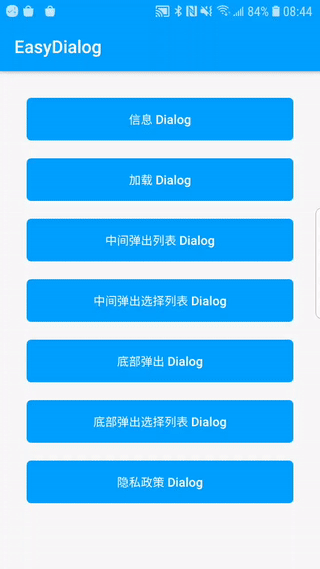
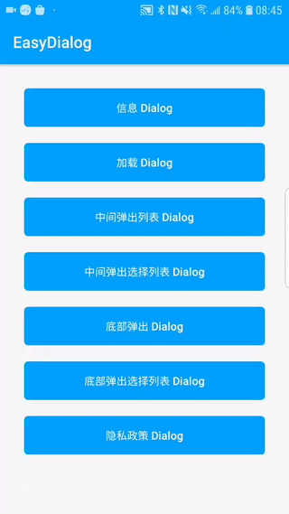
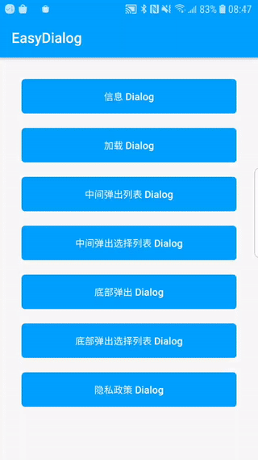
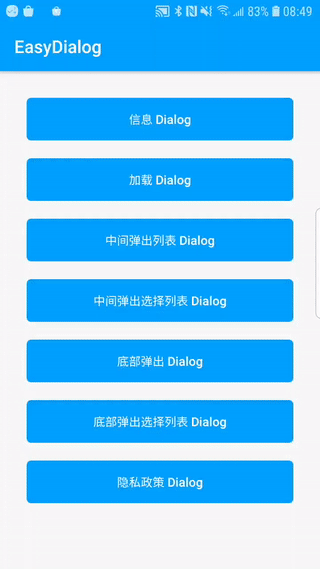

# EasyDialog
一款简单带动画的Dialog(Kotlin)

### 中文 | [English](https://github.com/Android-wangmeng/EasyDialog/blob/master/README_EN.md)

### 演示
|信息弹窗|加载弹窗|
|:---:|:---:|
|||

|中间列表弹窗|中间选择列表弹窗|
|:---:|:---:|
|||

|底部列表弹窗|底部选择列表弹窗|
|:---:|:---:|
|||

|隐私政策弹窗|
|:---:|
||

### 添加如下配置将EasyDialog引入到你的项目当中：
```groovv
dependencies {
    implementation 'com.dialog.wm:easydialog:1.0.1'
}
```

### API说明(EasyDialog)
```kotlin
    /**
     * 构建设置
     * @param animationTypeIn 进入动画(默认AnimationType.ZoomIn)
     * @param animationTypeOut 退出动画(默认AnimationType.ZoomOut)
     * @param dismissOnBack 点击返回建是否关闭Dialog(默认可以关闭)
     * @param dismissOnTouch 触摸空白区域是否关闭Dialog(默认可以关闭)
     */
    fun build(
        animationTypeIn: AnimationType = AnimationType.ZoomIn,
        animationTypeOut: AnimationType = AnimationType.ZoomOut,
        dismissOnBack: Boolean = true,
        dismissOnTouch: Boolean = true
    )

    /**
     * 显示取消、确定Dialog
     * @param title 标题
     * @param msg 内容
     * @param cancelText 左边按扭文字
     * @param confirmText 右边按扭文字
     * @param onConfirm 点击确定回调
     */
    fun showMessageDialog(
        title: String,
        msg: String,
        cancelText: String = "取消",
        confirmText: String = "确认",
        onConfirm: () -> Unit
    )

    /**
     * 显示中间列表Dialog
     * @param title 标题
     * @param list 显示的列表集合
     * @param iconIds 显示的图标集合
     * @param checkedPosition 选中的位置，传-1为不选中
     * @param primaryColor 文字主题颜色
     * @param onItem 列表点击回调
     */
    fun showCenterListDialog(
        title: String,
        list: Array<String>,
        iconIds: IntArray? = null,
        checkedPosition: Int = -1,
        @ColorRes primaryColor: Int = R.color.lib_colorPrimary,
        onItem: (position: Int, str: String) -> Unit
    )

    /**
     * 显示底部列表Dialog
     * @param title 标题
     * @param list 显示的列表集合
     * @param iconIds 显示的图标集合
     * @param checkedPosition 选中的位置，传-1为不选中
     * @param primaryColor 文字主题颜色
     * @param onItem 列表点击回调
     */
    fun showBottomListDialog(
        title: String,
        list: Array<String>,
        iconIds: IntArray? = null,
        checkedPosition: Int = -1,
        @ColorRes primaryColor: Int = R.color.lib_colorPrimary,
        onItem: (position: Int, str: String) -> Unit
    )

    /**
     * 加载Dialog
     * @param msg 显示的内容
     * @param indicator 指示器样式
     * @param indicatorColor 指示器颜色
     */
    fun showLoadDialog(
        msg: String,
        indicator: String = IndicatorType.LINE_SCALE_PULSE_OUT_RAPID_INDICATOR,
        @ColorRes indicatorColor: Int = R.color.lib_colorPrimary
    )

    /**
     * 隐私政策dialog
     * @param title 标题
     * @param msg 显示的内容
     * @param agreement 用户协议高亮显示
     * @param privacy 隐私政策高亮显示
     * @param onConfirm 确定回调
     * @param onCancel 取消回调
     * @param onAgreement 服务协议点击回调
     * @param onPrivacy 隐私政策点击回调
     */
    fun showPrivacyPolicy(
        title: String,
        msg: String,
        agreement: String,
        privacy: String,
        confirmText: String,
        cancelText: String,
        onConfirm: () -> Unit,
        onCancel: () -> Unit,
        onAgreement: () -> Unit,
        onPrivacy: () -> Unit
    )

    /**
     * 关闭Dialog
     */
    fun dismissDialog() {
        dialog?.dismiss()
    }

    /**
     * 关闭动画之后进行逻辑操作(防止抖动)
     */
    fun dismissWithDialog(dismiss: () -> Unit) {
        dialog?.dismissWith { dismiss() }
    }
```

### 使用方法
```kotlin
    //信息 Dialog
    EasyDialog.build().showMessageDialog()
    //加载 Dialog
    EasyDialog.build().showLoadDialog()
    //中间弹出列表 Dialog
    EasyDialog.build().showCenterListDialog()
    //底部弹出列表 Dialog
    EasyDialog.build().showBottomListDialog()
    //隐私政策 Dialog
    EasyDialog.build().showPrivacyPolicy()
```
### 加载框指示器样式(IndicatorType)
|Loading|
|:---:|
||

### Indicators

As seen above in the **Demo**, the indicators are as follows:

**Row 1**
 * `BallPulseIndicator`
 * `BallGridPulseIndicator`
 * `BallClipRotateIndicator`
 * `BallClipRotatePulseIndicator`

**Row 2**
 * `SquareSpinIndicator`
 * `BallClipRotateMultipleIndicator`
 * `BallPulseRiseIndicator`
 * `BallRotateIndicator`

**Row 3**
 * `CubeTransitionIndicator`
 * `BallZigZagIndicator`
 * `BallZigZagDeflectIndicator`
 * `BallTrianglePathIndicator`

**Row 4**
 * `BallScaleIndicator`
 * `LineScaleIndicator`
 * `LineScalePartyIndicator`
 * `BallScaleMultipleIndicator`

**Row 5**
 * `BallPulseSyncIndicator`
 * `BallBeatIndicator`
 * `LineScalePulseOutIndicator`
 * `LineScalePulseOutRapidIndicator`

**Row 6**
 * `BallScaleRippleIndicator`
 * `BallScaleRippleMultipleIndicator`
 * `BallSpinFadeLoaderIndicator`
 * `LineSpinFadeLoaderIndicator`

**Row 7**
 * `TriangleSkewSpinIndicator`
 * `PacmanIndicator`
 * `BallGridBeatIndicator`
 * `SemiCircleSpinIndicator`

### Dialog 动画(AnimationType)
#### Attension
`Pulse`, `RubberBand`, `Shake`, `Swing`, `Wobble`, `Bounce`, `Tada`, `StandUp`, `Wave`

#### Bounce
`BounceIn`, `BounceInDown`, `BounceInLeft`, `BounceInRight`, `BounceInUp`

#### Flip
`FlipInX`, `FlipOutX`, `FlipInY`,`FlipOutY`

#### Rotate
`RotateIn`, `RotateInDownLeft`, `RotateInDownRight`, `RotateInUpLeft`, `RotateInUpRight`

`RotateOut`, `RotateOutDownLeft`, `RotateOutDownRight`, `RotateOutUpLeft`, `RotateOutUpRight`

#### Slide
`SlideInLeft`, `SlideInRight`, `SlideInUp`, `SlideInDown`

`SlideOutLeft`, `SlideOutRight`, `SlideOutUp`, `SlideOutDown`

#### Zoom
`ZoomIn`, `ZoomInDown`, `ZoomInLeft`, `ZoomInRight`, `ZoomInUp`

`ZoomOut`, `ZoomOutDown`, `ZoomOutLeft`, `ZoomOutRight`, `ZoomOutUp`
### Thanks
- [XPopup](https://github.com/li-xiaojun/XPopup)
- [AVLoadingIndicatorView](https://github.com/81813780/AVLoadingIndicatorView)

### License
```
Copyright (C)  wangmeng, EasyToast Open Source Project

Licensed under the Apache License, Version 2.0 (the "License");
you may not use this file except in compliance with the License.
You may obtain a copy of the License at

     http://www.apache.org/licenses/LICENSE-2.0

Unless required by applicable law or agreed to in writing, software
distributed under the License is distributed on an "AS IS" BASIS,
WITHOUT WARRANTIES OR CONDITIONS OF ANY KIND, either express or implied.
See the License for the specific language governing permissions and
limitations under the License.
```
