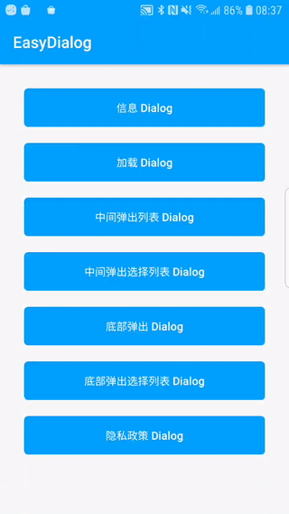
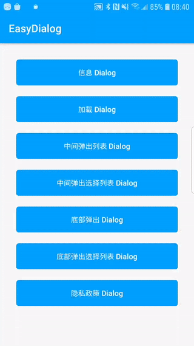
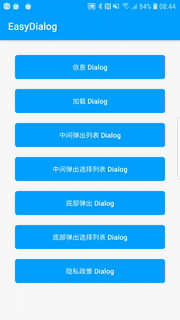
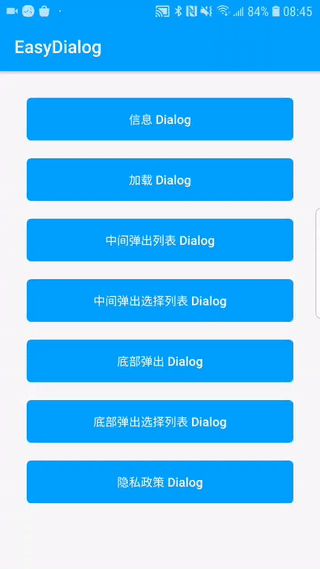
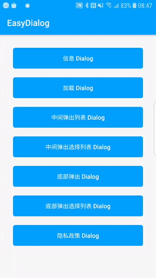
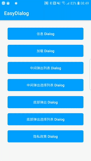

# EasyDialog
一款简单带动画的Dialog(Kotlin)

### English | [中文](https://github.com/Android-wangmeng/EasyDialog/blob/master/README.md)

### 演示
|Information Dialog|Loading Dialog|
|:---:|:---:|
|||

|Center List Dialog|Center Select List Dialog|
|:---:|:---:|
|||

|Bottom List Dialog|Bottom Select List Dialog |
|:---:|:---:|
|||

|Privacy policy Dialog|
|:---:|
||

### 添加如下配置将EasyDialog引入到你的项目当中：
```groovv
dependencies {
    implementation 'com.dialog.wm:easydialog:1.0.1'
}
```

### API Description(EasyDialog)
```kotlin
    /**
     * Build settings
     * @param animationTypeIn enter animation (default AnimationType.ZoomIn)
     * @param animationTypeOut exit animation (default AnimationType.ZoomOut)
     * @param dismissOnBack Click to return to build whether to close the Dialog (can be closed by default)
     * @param dismissOnTouch Whether to close the Dialog by touching the blank area (it can be closed by default)
     */
    fun build(
        animationTypeIn: AnimationType = AnimationType.ZoomIn,
        animationTypeOut: AnimationType = AnimationType.ZoomOut,
        dismissOnBack: Boolean = true,
        dismissOnTouch: Boolean = true
    )

    /**
     * Show Cancel, Confirm Dialog
     * @param title title
     * @param msg content
     * @param cancelText left button text
     * @param confirmText right button text
     * @param onConfirm Click to confirm callback
      */
    fun showMessageDialog(
        title: String,
        msg: String,
        cancelText: String = "取消",
        confirmText: String = "确认",
        onConfirm: () -> Unit
    )

    /**
     * Show the middle list Dialog
     * @param title title
     * @param list display list collection
     * @param iconIds display icon collection
     * @param checkedPosition selected position, pass -1 to uncheck
     * @param primaryColor text theme color
     * @param onItem list click callback
     */
    fun showCenterListDialog(
        title: String,
        list: Array<String>,
        iconIds: IntArray? = null,
        checkedPosition: Int = -1,
        @ColorRes primaryColor: Int = R.color.lib_colorPrimary,
        onItem: (position: Int, str: String) -> Unit
    )

    /**
     * Show the bottom list Dialog
     * @param title title
     * @param list display list collection
     * @param iconIds display icon collection
     * @param checkedPosition selected position, pass -1 to uncheck
     * @param primaryColor text theme color
     * @param onItem list click callback
     */
    fun showBottomListDialog(
        title: String,
        list: Array<String>,
        iconIds: IntArray? = null,
        checkedPosition: Int = -1,
        @ColorRes primaryColor: Int = R.color.lib_colorPrimary,
        onItem: (position: Int, str: String) -> Unit
    )

    /**
     * Load Dialog
     * @param msg content displayed
     * @param indicator indicator style
     * @param indicatorColor indicator color
     */
    fun showLoadDialog(
        msg: String,
        indicator: String = IndicatorType.LINE_SCALE_PULSE_OUT_RAPID_INDICATOR,
        @ColorRes indicatorColor: Int = R.color.lib_colorPrimary
    )

    /**
     * Privacy policy dialog
     * @param title title
     * @param msg content displayed
     * @param agreement user agreement is highlighted
     * @param privacy privacy policy highlighted
     * @param onConfirm confirm callback
     * @param onCancel cancel callback
     * @param onAgreement service agreement click callback
     * @param onPrivacy privacy policy click callback
     */
    fun showPrivacyPolicy(
        title: String,
        msg: String,
        agreement: String,
        privacy: String,
        confirmText: String,
        cancelText: String,
        onConfirm: () -> Unit,
        onCancel: () -> Unit,
        onAgreement: () -> Unit,
        onPrivacy: () -> Unit
    )

    /**
     * Close Dialog
     */
    fun dismissDialog() {
        dialog?.dismiss()
    }

    /**
     * Perform logical operations after closing the animation (to prevent jitter)
     */
    fun dismissWithDialog(dismiss: () -> Unit) {
        dialog?.dismissWith { dismiss() }
    }
```

### Instructions
```kotlin
    //Information Dialog
    EasyDialog.build().showMessageDialog()
    //Loading Dialog
    EasyDialog.build().showLoadDialog()
    //Center List Dialog
    EasyDialog.build().showCenterListDialog()
    //Bottom List Dialog
    EasyDialog.build().showBottomListDialog()
    //Privacy policy Dialog
    EasyDialog.build().showPrivacyPolicy()
```
### Loading box indicator style(IndicatorType)
|Loading|
|:---:|
||

### Indicators

As seen above in the **Demo**, the indicators are as follows:

**Row 1**
 * `BallPulseIndicator`
 * `BallGridPulseIndicator`
 * `BallClipRotateIndicator`
 * `BallClipRotatePulseIndicator`

**Row 2**
 * `SquareSpinIndicator`
 * `BallClipRotateMultipleIndicator`
 * `BallPulseRiseIndicator`
 * `BallRotateIndicator`

**Row 3**
 * `CubeTransitionIndicator`
 * `BallZigZagIndicator`
 * `BallZigZagDeflectIndicator`
 * `BallTrianglePathIndicator`

**Row 4**
 * `BallScaleIndicator`
 * `LineScaleIndicator`
 * `LineScalePartyIndicator`
 * `BallScaleMultipleIndicator`

**Row 5**
 * `BallPulseSyncIndicator`
 * `BallBeatIndicator`
 * `LineScalePulseOutIndicator`
 * `LineScalePulseOutRapidIndicator`

**Row 6**
 * `BallScaleRippleIndicator`
 * `BallScaleRippleMultipleIndicator`
 * `BallSpinFadeLoaderIndicator`
 * `LineSpinFadeLoaderIndicator`

**Row 7**
 * `TriangleSkewSpinIndicator`
 * `PacmanIndicator`
 * `BallGridBeatIndicator`
 * `SemiCircleSpinIndicator`

### Dialog Animation(AnimationType)
#### Attension
`Pulse`, `RubberBand`, `Shake`, `Swing`, `Wobble`, `Bounce`, `Tada`, `StandUp`, `Wave`

#### Bounce
`BounceIn`, `BounceInDown`, `BounceInLeft`, `BounceInRight`, `BounceInUp`

#### Flip
`FlipInX`, `FlipOutX`, `FlipInY`,`FlipOutY`

#### Rotate
`RotateIn`, `RotateInDownLeft`, `RotateInDownRight`, `RotateInUpLeft`, `RotateInUpRight`

`RotateOut`, `RotateOutDownLeft`, `RotateOutDownRight`, `RotateOutUpLeft`, `RotateOutUpRight`

#### Slide
`SlideInLeft`, `SlideInRight`, `SlideInUp`, `SlideInDown`

`SlideOutLeft`, `SlideOutRight`, `SlideOutUp`, `SlideOutDown`

#### Zoom
`ZoomIn`, `ZoomInDown`, `ZoomInLeft`, `ZoomInRight`, `ZoomInUp`

`ZoomOut`, `ZoomOutDown`, `ZoomOutLeft`, `ZoomOutRight`, `ZoomOutUp`
### Thanks
- [XPopup](https://github.com/li-xiaojun/XPopup)
- [AVLoadingIndicatorView](https://github.com/81813780/AVLoadingIndicatorView)

### License
```
Copyright (C)  wangmeng, EasyToast Open Source Project

Licensed under the Apache License, Version 2.0 (the "License");
you may not use this file except in compliance with the License.
You may obtain a copy of the License at

     http://www.apache.org/licenses/LICENSE-2.0

Unless required by applicable law or agreed to in writing, software
distributed under the License is distributed on an "AS IS" BASIS,
WITHOUT WARRANTIES OR CONDITIONS OF ANY KIND, either express or implied.
See the License for the specific language governing permissions and
limitations under the License.
```